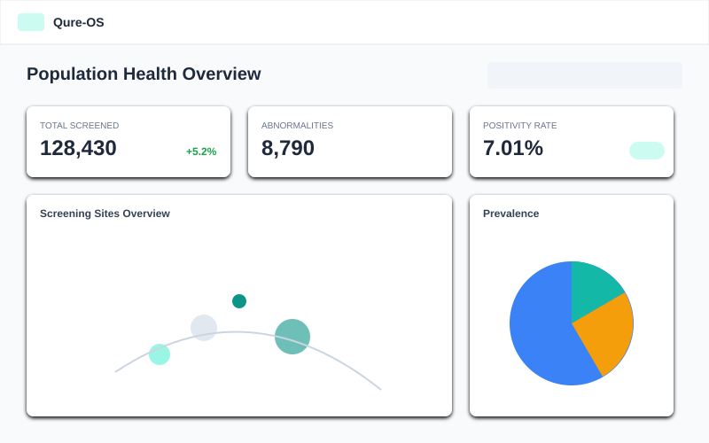
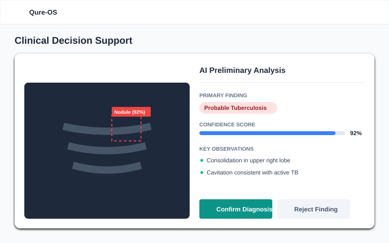
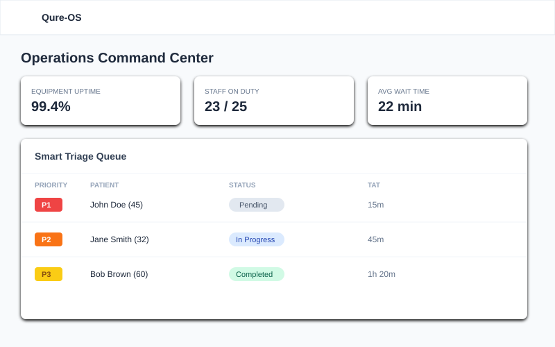
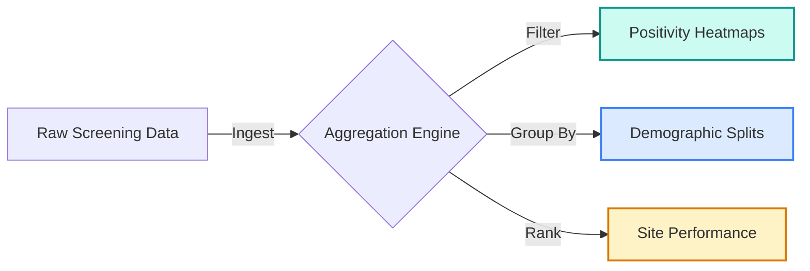
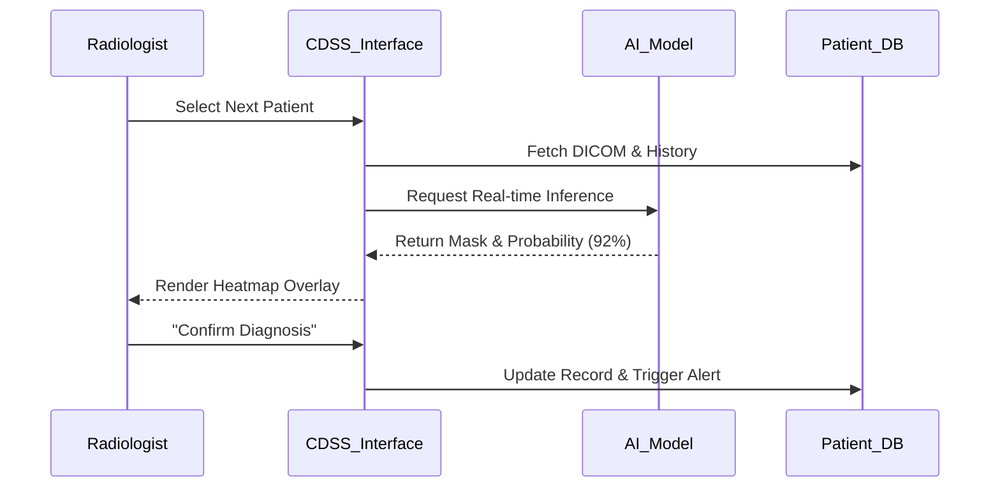
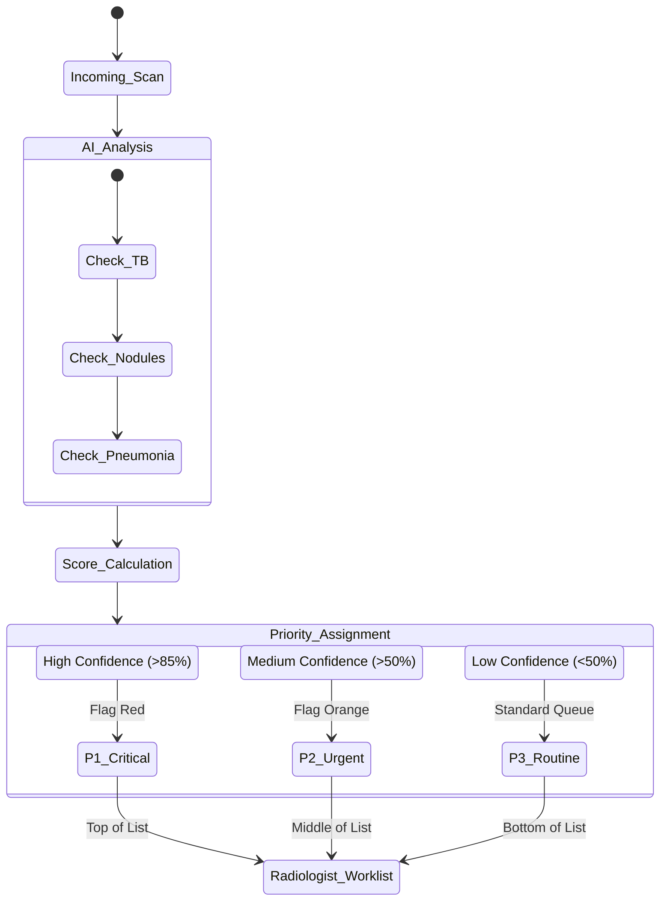

<div align="center">
  
  <!-- Qure-OS Logo -->
  <a href="https://ai.studio/apps/drive/1kguJ5Rdi5zZVISk58FQJzBhHYawByx5w?fullscreenApplet=true">
    
  </a>

  <br />
  <br />

  <a href="https://ai.studio/apps/drive/1kguJ5Rdi5zZVISk58FQJzBhHYawByx5w?fullscreenApplet=true">
    
  </a>
  
  <p align="center">
    <strong>The Operating System for High-Volume Radiology Screening</strong>
  </p>
</div>

---

## 📋 Table of Contents

1.  [The Story & Mission](#-the-story--mission)
2.  [The Problem](#-the-problem)
3.  [The Solution: Qure-OS](#-the-solution-qure-os)
4.  [Feature Deep Dive](#-feature-deep-dive)
5.  [Technical Workflows](#-technical-workflows)
6.  [System Architecture](#-system-architecture)

---

## 📖 The Story & Mission

In the fight against infectious diseases like Tuberculosis (TB) and silent killers like Lung Cancer, **time is the enemy**. 

Screening programs in developing regions often deploy mobile X-ray vans to rural areas, capturing thousands of images a day. However, the data often sits in silos. Radiologists are overwhelmed, equipment breaks down unnoticed, and patients with critical findings are lost in a chaotic paper trail.

**Qure-OS** was conceptualized to be the "Central Nervous System" for these initiatives. It is a personalized Health Management Information System (HMIS) designed specifically for the needs of AI-augmented radiology. It doesn't just store images; it *thinks*, *prioritizes*, and *alerts*.

---

## ⚠️ The Problem

| Challenge | Description |
| :--- | :--- |
| **Data Deluge** | A single screening site generates 500+ X-rays daily. Manual review is impossible. |
| **Triage Failure** | A patient with active TB might be 300th in the queue, waiting days for a result while infectious. |
| **Operational Opacity** | Administrators don't know if a CT scanner in a remote clinic is online or broken until end-of-month reports. |
| **Follow-up Leakage** | Positive cases are often lost to follow-up due to disconnected registration and result systems. |

---

## 💡 The Solution: Qure-OS

Qure-OS integrates **Clinical AI** (detection) with **Operational Intelligence** (logistics).

1.  **Ingest:** DICOM images are pushed from scanners.
2.  **Analyze:** AI algorithms run instantly, tagging findings (TB, Nodule, etc.).
3.  **Prioritize:** The "Smart Triage Engine" re-orders the radiologist's worklist.
4.  **Monitor:** IoT sensors track machine health and staff activity.

---

## 🔬 Feature Deep Dive

| Feature Module | Visual Overview | Details |
| :--- | :--- | :--- |
| **Population Health** |  | **The "General's View"**<br>Aggregates data across all screening sites to visualize disease hotspots and demographic trends.<br>• **Metrics:** Total Screened, Positivity Rate.<br>• **Visuals:** Maps, Age Pyramids, Trends. |
| **Clinical AI** |  | **The "Radiologist's Co-pilot"**<br>Uses deep learning to assist clinicians.<br>• **Smart Triage:** Sorts by Urgency.<br>• **Visual Grounding:** Bounding boxes.<br>• **Confidence Scores:** "92% TB Probability". |
| **Operations Center** |  | **The "Control Tower"**<br>Ensures the machinery of healthcare keeps running.<br>• **Telemetry:** Scanner Online/Offline status.<br>• **Throughput:** Patients/Hour monitoring.<br>• **Resource Allocation:** Staff management. |

---

## ⚙️ Technical Workflows

### 1. Population Health Aggregation
How the system turns raw screening data into actionable epidemiological insights.



### 2. Clinical Decision Support (CDSS) Flow
The interaction loop between the Radiologist and the AI Assistant.



### 3. Smart Triage Logic
The "Brain" that decides who gets treated first, replacing standard FIFO queues with AI-driven prioritization.



---

## 🏗️ System Architecture

The app is built as a responsive **Single Page Application (SPA)** using **React 19** and **TypeScript**, styled with **Tailwind CSS**.

```mermaid
graph TD
    User[Clinician / Admin] -->|HTTPS| Frontend[React SPA (Vite)]
    
    subgraph "Qure-OS Frontend Layer"
        Frontend --> Router[Navigation Router]
        Router --> Dash1[Pop. Health Dashboard]
        Router --> Dash2[Clinical CDSS]
        Router --> Dash3[Ops Command Center]
        
        Dash1 --> Viz[Recharts Engine]
        Dash2 --> Inf[Inference Simulator]
        Dash3 --> Live[Real-time Hooks]
    end

    subgraph "Data Simulation Layer"
        Inf --> MockAI[Mock AI Service]
        Live --> MockIoT[Mock IoT Service]
        Viz --> MockDB[Mock Database]
    end
```

---

<div align="center">
    <p><em>Designed for Impact. Engineered for Speed.</em></p>
    <p>© 2024 Qure-OS Concept</p>
</div>
