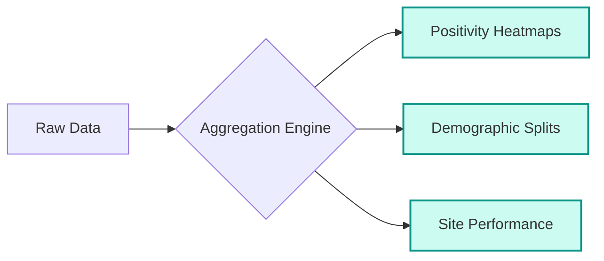
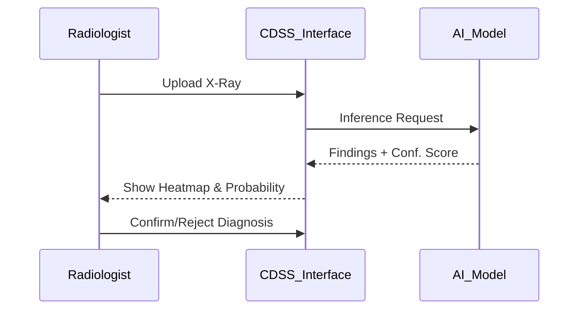

<div align="center">
  
  <!-- Qure-OS Logo SVG -->
  <svg xmlns="http://www.w3.org/2000/svg" viewBox="0 0 400 120" width="400" height="120">
    <g transform="translate(40, 30) scale(2.5)">
       <path d="M12 3v18" stroke="#0d9488" stroke-width="1.5" stroke-linecap="round"/>
       <path d="M16 8.5a4 4 0 0 1 0 7" stroke="#0d9488" stroke-width="1.5" stroke-linecap="round"/>
       <path d="M8 8.5a4 4 0 0 0 0 7" stroke="#0d9488" stroke-width="1.5" stroke-linecap="round"/>
       <circle cx="12" cy="12" r="2" fill="#0d9488"/>
       <path d="M19.5 5.5a9 9 0 0 1 0 13" stroke="#0d9488" stroke-width="1.5" stroke-linecap="round" opacity="0.6"/>
       <path d="M4.5 5.5a9 9 0 0 0 0 13" stroke="#0d9488" stroke-width="1.5" stroke-linecap="round" opacity="0.6"/>
    </g>
    <text x="110" y="65" font-family="Arial, sans-serif" font-size="42" font-weight="bold" fill="#1e293b">Qure-OS</text>
    <text x="112" y="85" font-family="Arial, sans-serif" font-size="12" letter-spacing="3" font-weight="bold" fill="#0d9488">RADIOLOGY INTELLIGENCE</text>
  </svg>

  <br />
  <br />

  <a href="https://ai.studio/apps/drive/1kguJ5Rdi5zZVISk58FQJzBhHYawByx5w?fullscreenApplet=true">
    
  </a>
  
  <p align="center">
    <strong>The Operating System for High-Volume Radiology Screening</strong>
  </p>
</div>

---

## 📋 Table of Contents

1.  [The Story & Mission](#-the-story--mission)
2.  [The Problem](#-the-problem)
3.  [The Solution: Qure-OS](#-the-solution-qure-os)
4.  [Feature Deep Dive](#-feature-deep-dive)
    *   [Population Health](#1-population-health-surveillance)
    *   [Clinical AI & Decision Support](#2-clinical-decision-support-cdss)
    *   [Smart Operations Center](#3-smart-operations-center)
5.  [System Architecture](#-system-architecture)

---

## 📖 The Story & Mission

In the fight against infectious diseases like Tuberculosis (TB) and silent killers like Lung Cancer, **time is the enemy**. 

Screening programs in developing regions often deploy mobile X-ray vans to rural areas, capturing thousands of images a day. However, the data often sits in silos. Radiologists are overwhelmed, equipment breaks down unnoticed, and patients with critical findings are lost in a chaotic paper trail.

**Qure-OS** was conceptualized to be the "Central Nervous System" for these initiatives. It is a personalized Health Management Information System (HMIS) designed specifically for the needs of AI-augmented radiology. It doesn't just store images; it *thinks*, *prioritizes*, and *alerts*.

---

## ⚠️ The Problem

| Challenge | Description |
| :--- | :--- |
| **Data Deluge** | A single screening site generates 500+ X-rays daily. Manual review is impossible. |
| **Triage Failure** | A patient with active TB might be 300th in the queue, waiting days for a result while infectious. |
| **Operational Opacity** | Administrators don't know if a CT scanner in a remote clinic is online or broken until end-of-month reports. |
| **Follow-up Leakage** | Positive cases are often lost to follow-up due to disconnected registration and result systems. |

---

## 💡 The Solution: Qure-OS

Qure-OS integrates **Clinical AI** (detection) with **Operational Intelligence** (logistics).

1.  **Ingest:** DICOM images are pushed from scanners.
2.  **Analyze:** AI algorithms run instantly, tagging findings (TB, Nodule, etc.).
3.  **Prioritize:** The "Smart Triage Engine" re-orders the radiologist's worklist.
4.  **Monitor:** IoT sensors track machine health and staff activity.

---

## 🔬 Feature Deep Dive

### 1. Population Health Surveillance
*The "General's View" of the battlefield.*

This module provides macro-level analytics to Ministry of Health officials. It aggregates data across all screening sites to visualize disease hotspots and demographic trends.



*   **Key Metrics:** Total Screened, Positivity Rate, Abnormalities Detected.
*   **Visuals:** Interactive maps, Age/Gender pyramids, Infection trend lines.

### 2. Clinical Decision Support (CDSS)
*The "Radiologist's Co-pilot".*

This is the core diagnostic interface. It uses deep learning models to assist clinicians.



*   **Smart Features:**
    *   **Automated Triage:** Sorts cases by 'Urgency' rather than 'Time Received'.
    *   **Visual Grounding:** Bounding boxes around nodules/opacities.
    *   **Confidence Scoring:** "92% Probability of TB".

### 3. Smart Operations Center
*The "Control Tower".*

Ensures the machinery of healthcare keeps running. It monitors the physical infrastructure and human resources.

```mermaid
gantt
    title Radiology Resource Optimization (Live View)
    dateFormat  HH:mm
    axisFormat %H:%M
    
    section CT Scanner 1
    Patient Scan      :active,    08:00, 08:30
    Sanitization      :           08:30, 08:45
    Patient Scan      :           08:45, 09:15
    
    section X-Ray Room A
    Rapid Screening   :active,    08:00, 10:00
    Maintenance       :crit,      10:00, 11:00
```



*   **Live Telemetry:** MRI/CT/X-Ray Online/Offline status.
*   **Staffing:** Real-time view of Radiologists vs Technicians on duty.
*   **Throughput:** Patients processed per hour to identify bottlenecks.

---

## 🏗️ System Architecture

The app is built as a responsive **Single Page Application (SPA)** using **React 19** and **TypeScript**, styled with **Tailwind CSS**.

```mermaid
graph TD
    User[Clinician / Admin] -->|HTTPS| Frontend[React SPA (Vite)]
    
    subgraph "Qure-OS Frontend Layer"
        Frontend --> Router[Navigation Router]
        Router --> Dash1[Pop. Health Dashboard]
        Router --> Dash2[Clinical CDSS]
        Router --> Dash3[Ops Command Center]
        
        Dash1 --> Viz[Recharts Engine]
        Dash2 --> Inf[Inference Simulator]
        Dash3 --> Live[Real-time Hooks]
    end

    subgraph "Data Simulation Layer"
        Inf --> MockAI[Mock AI Service]
        Live --> MockIoT[Mock IoT Service]
        Viz --> MockDB[Mock Database]
    end
```

---

<div align="center">
    <p><em>Designed for Impact. Engineered for Speed.</em></p>
    <p>© 2024 Qure-OS Concept</p>
</div>
